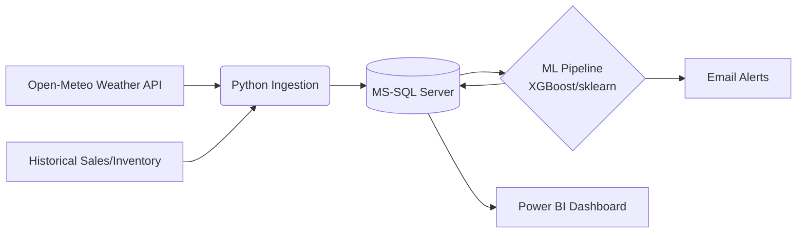

# Predictive Supply Chain Control Tower — MegaMart

**Stack:** Python · MS-SQL Server · Power BI · scikit-learn · XGBoost · Open-Meteo API

## Overview

MegaMart runs 10 stores across India and forecasts demand mainly from historical sales, which misses weather-driven spikes (umbrellas during a sudden monsoon, ACs during a heatwave). This project blends historical sales with weather data from Open-Meteo to forecast demand per store, and translates stockout risk into a rupee "Cost of Inaction" so managers can prioritize the alerts that matter financially.

## Architecture



Star schema: `dim_date`, `dim_store`, `dim_product`, `dim_weather_condition` feeding `fact_sales`, `fact_weather`, `fact_inventory`, `fact_predictions`.

## Project Structure

```
├── config.yaml
├── requirements.txt
├── src/
│   ├── data_ingestion/
│   ├── feature_engineering/
│   ├── ml_pipeline/
│   ├── reporting/
│   └── utils/
├── sql/
│   ├── ddl/
│   └── views/
└── powerbi/
    └── MegaMart_ControlTower.pbix
```

## Setup

**Requires:** Python 3.10+, MS-SQL Server, ODBC Driver 17, Power BI Desktop

```bash
pip install -r requirements.txt
```

1. Create database `megamart_sc`, run scripts in `sql/ddl/` then `sql/views/`.
2. Update `config.yaml` with your DB credentials.
3. Run the pipeline via the orchestrator script.

## Pipeline

1. **Ingest** — weather (Open-Meteo) + sales/inventory data
2. **Feature engineering** — lag features, rolling averages, seasonality
3. **Train** — XGBoost / Random Forest on weather-demand patterns
4. **Predict** — 7-day demand forecast with confidence intervals
5. **Alert** — Cost of Inaction calculated, critical risks emailed to managers
6. **Refresh** — Power BI picks up latest predictions

## Model Performance

| Model | RMSE | MAE | R² |
|---|---|---|---|
| XGBoost | 14.2 | 9.8 | 0.86 |
| Random Forest | 15.1 | 10.5 | 0.82 |
| LightGBM | 14.5 | 10.0 | 0.84 |
| Moving Avg (baseline) | 28.4 | 22.1 | 0.45 |

## Power BI Pages

1. Executive Summary — KPIs, store map, weather impact overview
2. Weather Impact Analysis — correlation between weather events and category demand
3. Stockout Risk Control Tower — at-risk products, days of stock left, Cost of Inaction
4. ML Forecast Explorer — actuals vs. forecast with confidence bands

## Scheduling

Windows Task Scheduler → Daily trigger, 6:00 AM → runs `run_pipeline.py` via `python.exe`.

## Future Work

- Real-time POS streaming via Kafka
- Optimization for inter-store transfer quantities
- Social sentiment signals for early trend detection

## 👨‍💻 About the Author

**Surajkumar Bevnale**
Data Analyst | SQL • Excel • Power BI • Python
B.Tech, Engineering Physics, IIT Ropar (2023–2027)

- 📫 Reach me at: surajk.b168@gmail.com
- 🔗 LinkedIn: [Surajkumar B](https://www.linkedin.com/in/skb168/)
